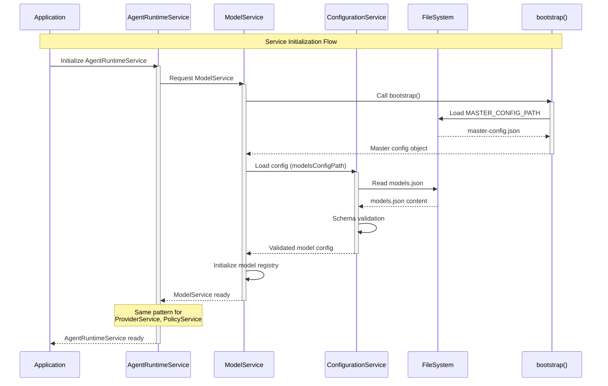
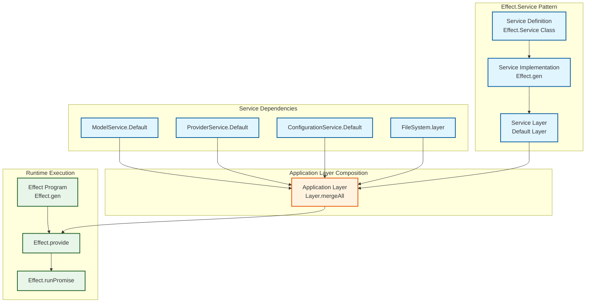
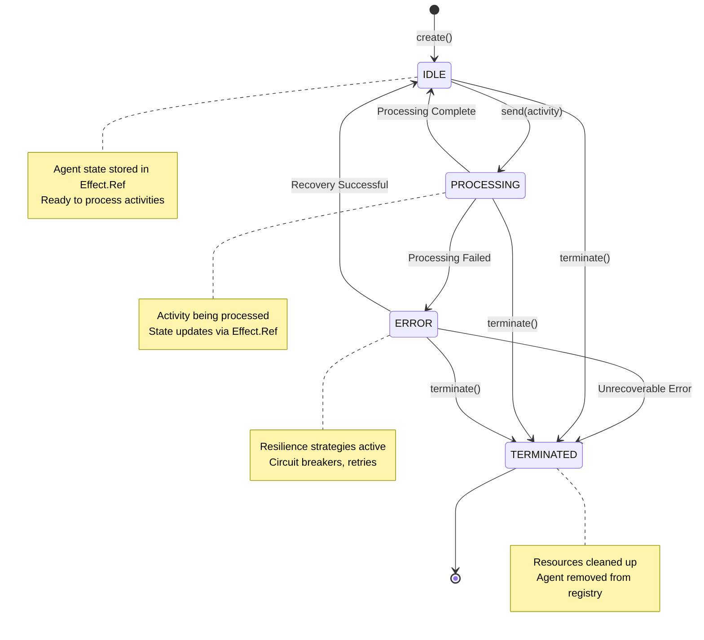
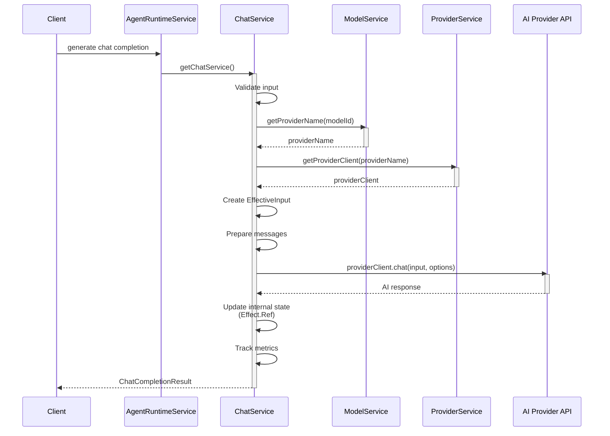
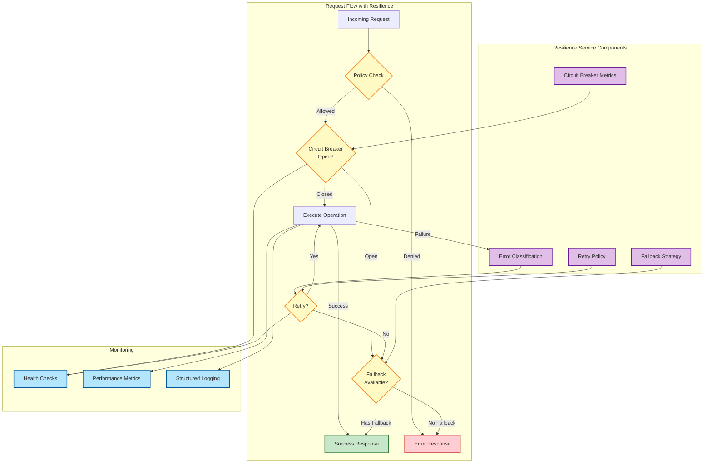
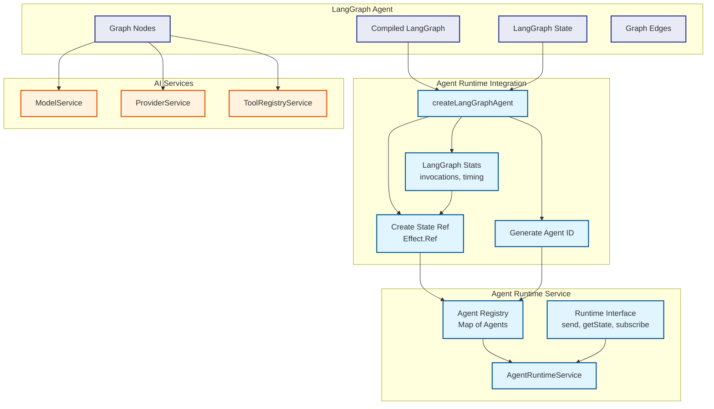
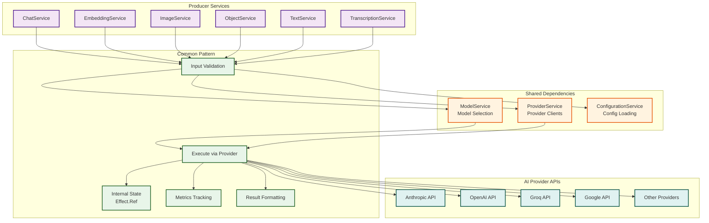

# EffectiveAgent Architecture

This document provides a comprehensive visual architecture of the EffectiveAgent framework using Mermaid diagrams.

## System Overview

```mermaid
graph TB
    subgraph "Client Layer"
        CLIENT[Client Application]
        CLI[EA CLI]
    end

    subgraph "Agent Runtime Layer"
        ARS[AgentRuntimeService<br/>Central Orchestration]
        LGAGENT[LangGraph Agent Runtime]
        STATE[Agent State Management<br/>Effect.Ref]
    end

    subgraph "AI Services Layer"
        MS[ModelService<br/>Model Definitions]
        PS[ProviderService<br/>AI Provider Clients]
        POLS[PolicyService<br/>Usage Policies]
        TRS[ToolRegistryService<br/>Tool Registry]
    end

    subgraph "Producer Services"
        CHAT[ChatService<br/>Chat Completions]
        EMB[EmbeddingService<br/>Vector Embeddings]
        IMG[ImageService<br/>Image Generation]
        OBJ[ObjectService<br/>Structured Output]
        TXT[TextService<br/>Text Generation]
        TRANS[TranscriptionService<br/>Audio Transcription]
    end

    subgraph "Execution Services"
        ORCH[OrchestratorService<br/>Policy Orchestration]
        RES[ResilienceService<br/>Circuit Breakers & Retries]
    end

    subgraph "Core Services"
        CONFIG[ConfigurationService<br/>Config Loading & Validation]
        HEALTH[HealthService<br/>Service Health]
        PERF[PerformanceService<br/>Metrics & Monitoring]
        WS[WebSocketService<br/>Real-time Communication]
    end

    subgraph "Infrastructure Layer"
        FS[FileSystem<br/>@effect/platform]
        BOOTSTRAP[Bootstrap<br/>Master Config Loader]
    end

    subgraph "Configuration Files"
        MASTER[master-config.json]
        MODELS[models.json]
        PROVIDERS[providers.json]
        POLICIES[policies.json]
    end

    %% Client connections
    CLIENT --> ARS
    CLI --> ARS

    %% Agent Runtime connections
    ARS --> MS
    ARS --> PS
    ARS --> POLS
    ARS --> TRS
    ARS --> STATE
    ARS --> LGAGENT

    %% Producer service connections
    ARS -.-> CHAT
    CHAT --> MS
    CHAT --> PS
    EMB --> MS
    EMB --> PS
    IMG --> MS
    IMG --> PS
    OBJ --> MS
    OBJ --> PS
    TXT --> MS
    TXT --> PS
    TRANS --> MS
    TRANS --> PS

    %% Execution service connections
    ORCH --> POLS
    ORCH --> RES
    RES --> HEALTH
    RES --> PERF

    %% Core service connections
    MS --> CONFIG
    PS --> CONFIG
    POLS --> CONFIG
    TRS --> CONFIG
    CONFIG --> FS
    CONFIG --> BOOTSTRAP

    %% Configuration loading
    BOOTSTRAP --> MASTER
    CONFIG --> MODELS
    CONFIG --> PROVIDERS
    CONFIG --> POLICIES

    %% Styling
    classDef runtime fill:#e1f5ff,stroke:#01579b,stroke-width:3px
    classDef ai fill:#fff3e0,stroke:#e65100,stroke-width:2px
    classDef producer fill:#f3e5f5,stroke:#4a148c,stroke-width:2px
    classDef core fill:#e8f5e9,stroke:#1b5e20,stroke-width:2px
    classDef config fill:#fce4ec,stroke:#880e4f,stroke-width:2px
    classDef client fill:#e0f2f1,stroke:#004d40,stroke-width:2px

    class ARS,LGAGENT,STATE runtime
    class MS,PS,POLS,TRS ai
    class CHAT,EMB,IMG,OBJ,TXT,TRANS producer
    class CONFIG,HEALTH,PERF,WS,FS,BOOTSTRAP core
    class MASTER,MODELS,PROVIDERS,POLICIES config
    class CLIENT,CLI client
```

## Service Self-Configuration Pattern



## Effect.Service Dependency Injection



## Agent Runtime Lifecycle



## Chat Completion Flow



## Resilience & Error Handling



## Configuration Architecture

```mermaid
graph TB
    subgraph "Environment"
        ENV[Environment Variables]
        ENV_MASTER[MASTER_CONFIG_PATH]
        ENV_API[API Keys]
    end

    subgraph "Master Configuration"
        MASTER[master-config.json]
        RUNTIME[Runtime Settings]
        LOGGING[Logging Config]
        PATHS[Service Config Paths]
    end

    subgraph "Service Configurations"
        MODELS[models.json<br/>AI Models & Capabilities]
        PROVIDERS[providers.json<br/>Provider Clients]
        POLICIES[policies.json<br/>Usage Policies]
    end

    subgraph "Bootstrap Process"
        BOOT[bootstrap()]
        LOAD[Load Master Config]
        VALIDATE[Schema Validation]
    end

    subgraph "Service Self-Configuration"
        MS_CONFIG[ModelService<br/>loads models.json]
        PS_CONFIG[ProviderService<br/>loads providers.json]
        POL_CONFIG[PolicyService<br/>loads policies.json]
    end

    ENV_MASTER --> BOOT
    ENV_API --> PS_CONFIG

    BOOT --> LOAD
    LOAD --> MASTER
    MASTER --> RUNTIME
    MASTER --> LOGGING
    MASTER --> PATHS

    PATHS --> VALIDATE
    VALIDATE --> MS_CONFIG
    VALIDATE --> PS_CONFIG
    VALIDATE --> POL_CONFIG

    MODELS --> MS_CONFIG
    PROVIDERS --> PS_CONFIG
    POLICIES --> POL_CONFIG

    classDef env fill:#fff3e0,stroke:#e65100,stroke-width:2px
    classDef config fill:#fce4ec,stroke:#880e4f,stroke-width:2px
    classDef process fill:#e8f5e9,stroke:#1b5e20,stroke-width:2px
    classDef service fill:#e1f5ff,stroke:#01579b,stroke-width:2px

    class ENV,ENV_MASTER,ENV_API env
    class MASTER,RUNTIME,LOGGING,PATHS,MODELS,PROVIDERS,POLICIES config
    class BOOT,LOAD,VALIDATE process
    class MS_CONFIG,PS_CONFIG,POL_CONFIG service
```

## LangGraph Agent Integration



## Producer Services Architecture



## Key Architectural Principles

### 1. Service Self-Configuration
Each service loads its own configuration via `ConfigurationService` and `bootstrap()`, eliminating circular dependencies.

### 2. Effect.Service Pattern
All services use the `Effect.Service` class pattern for dependency injection with automatic layer management.

### 3. Functional Design
Built on Effect-TS for composable, type-safe asynchronous operations with comprehensive error handling.

### 4. Agent-Centric Runtime
Designed for managing multi-capability AI agents with stateful execution and type-safe state management via `Effect.Ref`.

### 5. Resilience by Design
Built-in circuit breakers, retries, and fallback strategies for robust error handling and recovery.

### 6. Configuration-Driven
Schema-validated configuration files for models, providers, and policies with environment-specific support.

## Technology Stack

- **Runtime:** Bun & Node.js
- **Language:** TypeScript 5.8+
- **Effect System:** Effect-TS 3.16+
- **AI SDK:** Vercel AI SDK
- **Testing:** Vitest
- **Linting:** Biome
- **Platform:** @effect/platform (cross-platform abstractions)
