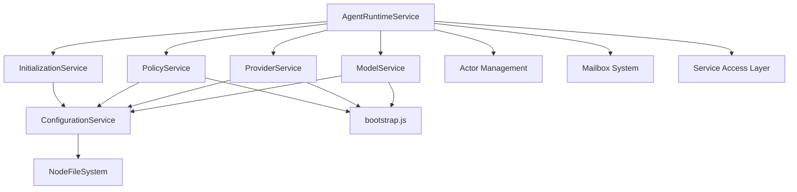

# Agent Runtime Service Architecture

## Overview

The Agent Runtime Service is the central orchestration layer in the EffectiveAgent system. It provides a clean, functional architecture using Effect-TS for managing agent lifecycles while serving as the primary interface for accessing configured AI services (ModelService, ProviderService, PolicyService).

## Core Architecture Principles

### 1. Service Self-Configuration
Each domain service is responsible for loading its own configuration:
- **ModelService** loads model definitions via ConfigurationService
- **ProviderService** loads provider configurations via ConfigurationService  
- **PolicyService** loads policy rules via ConfigurationService
- **AgentRuntimeService** orchestrates these pre-configured services

### 2. Effect.Service Pattern
All services use the canonical Effect.Service class pattern:
```typescript
export class ServiceName extends Effect.Service<ServiceApi>()(
  "ServiceName", 
  { 
    effect: serviceImplementationEffect,
    dependencies: [ConfigurationService.Default]
  }
) { }
```

### 3. Bootstrap Configuration Loading
Services use the `bootstrap()` function to access master configuration paths:
```typescript
const masterConfig = bootstrap();
const config = yield* configService.loadModelConfig(masterConfig.agents.modelsConfigPath);
```

## System Architecture



## Component Details

### 1. AgentRuntimeService

**Responsibilities:**
- Agent actor/mailbox lifecycle management (create, terminate, send, getState)
- Service orchestration and access layer
- Dependency injection coordination
- Runtime state management

**Key Features:**
- Creates and manages agent actors with prioritized mailboxes
- Provides access to configured domain services
- Handles actor termination and cleanup
- Thread-safe state management via Effect.Ref

### 2. Domain Services

#### ModelService
- **Purpose**: AI model configuration and metadata
- **Config**: Loads `models.json` containing model definitions
- **API**: Model validation, capability queries, provider mapping

#### ProviderService  
- **Purpose**: AI provider configuration and client management
- **Config**: Loads `providers.json` containing provider definitions
- **API**: Provider validation, client creation, capability queries

#### PolicyService
- **Purpose**: AI operation policy enforcement and auditing
- **Config**: Loads `policy.json` containing policy rules
- **API**: Policy checking, rule management, outcome recording

### 3. Supporting Services

#### ConfigurationService
- **Purpose**: Centralized configuration loading and validation
- **Dependencies**: NodeFileSystem
- **API**: Type-safe configuration loading with Schema validation

#### InitializationService
- **Purpose**: Runtime initialization and service composition
- **Responsibilities**: Creates runtime with all configured services
- **Usage**: Bootstrap function for production applications

## Message Processing Architecture

### Actor Lifecycle
```mermaid
sequenceDiagram
    participant Client
    participant AgentRuntimeService
    participant Actor
    participant Mailbox
    participant Workflow
    
    Client->>AgentRuntimeService: create(id, state)
    AgentRuntimeService->>Actor: initialize
    AgentRuntimeService->>Mailbox: create PrioritizedMailbox
    AgentRuntimeService->>Workflow: start processing fiber
    AgentRuntimeService-->>Client: RuntimeInterface
    
    Client->>AgentRuntimeService: send(id, activity)
    AgentRuntimeService->>Mailbox: enqueue activity
    Mailbox->>Workflow: dequeue for processing
    Workflow->>Actor: update state
    Workflow-->>Client: processing complete
```

### State Management
- **Effect.Ref**: Thread-safe state containers
- **Immutable Updates**: State changes via pure functions
- **Status Tracking**: IDLE, PROCESSING, ERROR, TERMINATED
- **Metrics Collection**: Processing latency, activity counts

## Configuration Architecture

### Master Configuration
```json
{
  "runtimeSettings": {
    "fileSystemImplementation": "node"
  },
  "logging": {
    "level": "info",
    "filePath": "./logs/app.log"
  },
  "agents": {
    "modelsConfigPath": "./config/models.json",
    "providersConfigPath": "./config/providers.json", 
    "policiesConfigPath": "./config/policy.json"
  }
}
```

### Service Configuration Flow
1. **Bootstrap**: Master config loaded via environment variable `MASTER_CONFIG_PATH`
2. **Service Init**: Each service calls `bootstrap()` to get config paths
3. **Config Loading**: Services load their specific configurations
4. **Validation**: Schema validation ensures type safety
5. **Service Ready**: Configured services available via AgentRuntimeService

## Dependency Injection

### Layer Composition
```typescript
const ApplicationLayer = Layer.mergeAll(
  ConfigurationService.Default,
  ModelService.Default,
  ProviderService.Default, 
  PolicyService.Default,
  AgentRuntimeService.Default,
  NodeFileSystem.layer
);
```

### Service Access
```typescript
// Get configured services from AgentRuntimeService
const runtime = yield* AgentRuntimeService;
const modelService = yield* runtime.getModelService();
const providerService = yield* runtime.getProviderService();
const policyService = yield* runtime.getPolicyService();
```

## Error Handling

### Error Hierarchy
- **AgentRuntimeError**: Base runtime errors
- **AgentRuntimeNotFoundError**: Actor not found
- **AgentRuntimeProcessingError**: Processing failures
- **AgentRuntimeTerminatedError**: Actor already terminated

### Recovery Strategies
- **Graceful Degradation**: Continue with reduced functionality
- **State Preservation**: Maintain actor state during errors
- **Resource Cleanup**: Proper fiber and mailbox cleanup
- **Error Propagation**: Clear error context through causes

## Testing Architecture

### Test Strategy
- **Real Services**: No mocks, use real service implementations
- **Temporary Configs**: Create test configuration files in beforeEach
- **Layer Composition**: Use Layer.mergeAll for dependency injection
- **Cleanup**: Remove test files in afterEach

### Test Layer Pattern
```typescript
beforeEach(() => {
  // Create test config files
  writeFileSync(masterConfigPath, JSON.stringify(validMasterConfig));
  process.env.MASTER_CONFIG_PATH = masterConfigPath;
});

const testProgram = Effect.provide(
  testEffect,
  Layer.mergeAll(
    ConfigurationService.Default,
    ModelService.Default,
    ProviderService.Default,
    PolicyService.Default,
    AgentRuntimeService.Default,
    NodeFileSystem.layer
  )
);
```

## Performance Characteristics

### Memory Management
- **Ref-based State**: Efficient immutable updates
- **Fiber Management**: Lightweight concurrent processing
- **Queue Limits**: Bounded mailbox sizes
- **Resource Cleanup**: Automatic cleanup on termination

### Concurrency Model
- **Fiber-based**: Non-blocking concurrent processing
- **Message Queues**: Priority-based activity processing
- **State Isolation**: Independent actor state management
- **Thread Safety**: Effect.Ref provides safe concurrent access

## Security Model

### Configuration Security
- **Schema Validation**: Type-safe configuration loading
- **Path Validation**: Secure file path resolution
- **Environment Isolation**: Environment-specific configuration

### Runtime Security
- **State Encapsulation**: Private actor state management
- **Resource Limits**: Bounded queues and processing limits
- **Error Containment**: Isolated error handling per actor

## Future Enhancements

### Planned Features
- **Distributed Actors**: Cross-node actor communication
- **State Persistence**: Durable actor state storage
- **Advanced Monitoring**: Enhanced metrics and observability
- **Hot Configuration**: Runtime configuration updates

### Scalability Considerations
- **Horizontal Scaling**: Multi-instance deployment support
- **State Partitioning**: Distributed state management
- **Load Balancing**: Intelligent actor placement
- **Resource Optimization**: Advanced memory and CPU management 