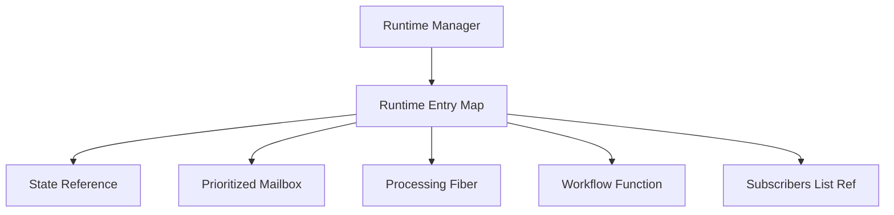
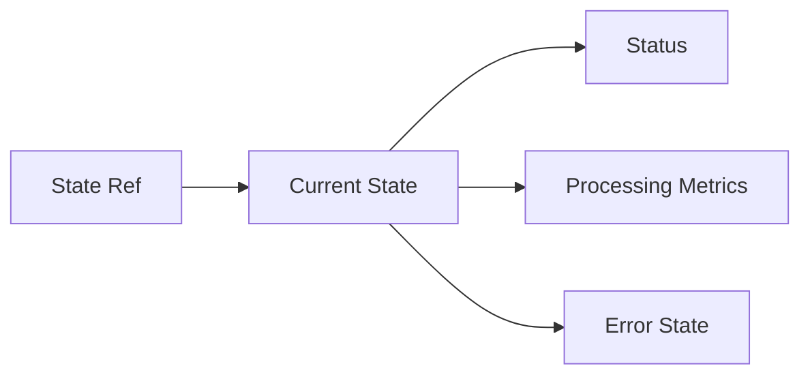
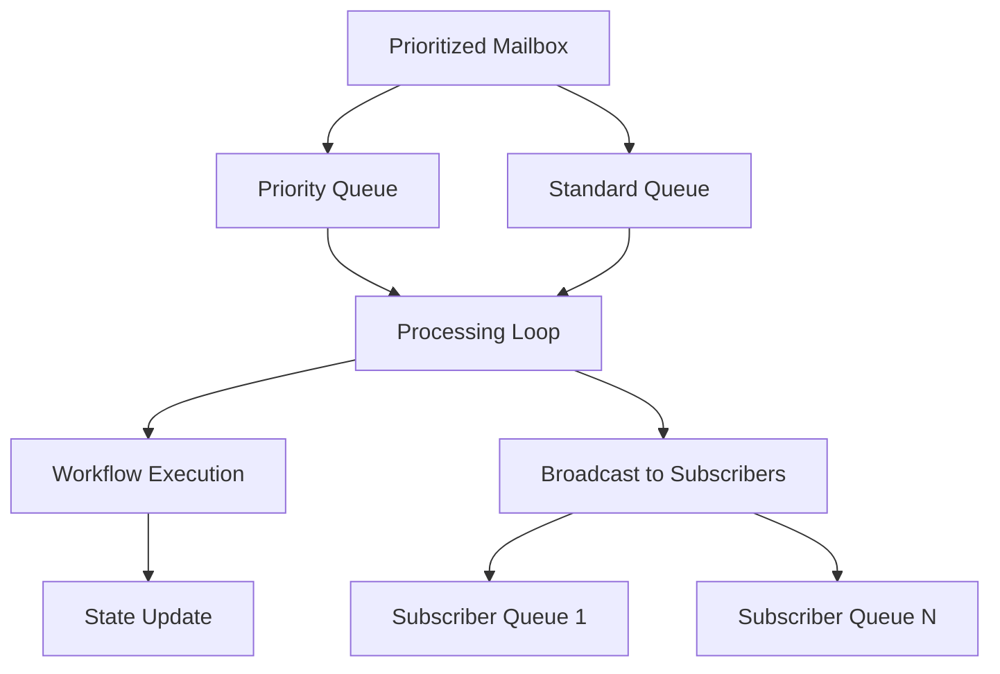
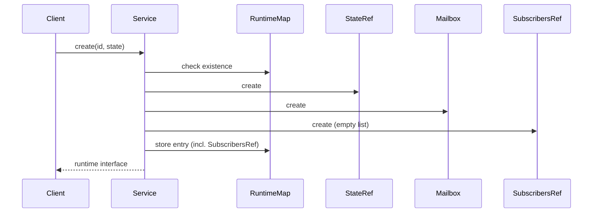
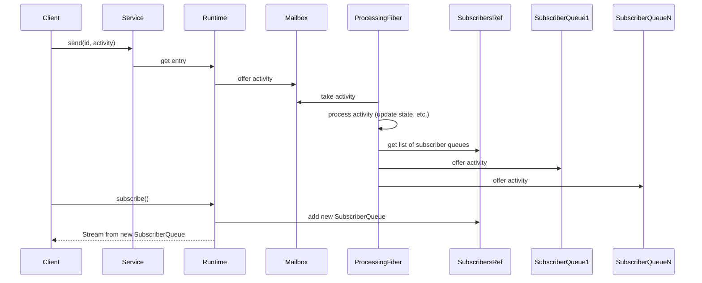

# Agent Runtime Service Architecture - v1

## Overview

The Agent Runtime Service is built on a message-driven architecture using Effect for functional programming patterns and type-safe operations. The service manages multiple agent runtimes, each with its own state, message queue, and processing workflow. Each runtime can have multiple subscribers, and activities are broadcast to all of them.

## Core Components

### 1. Runtime Manager

The Runtime Manager maintains a thread-safe map of runtime entries, each containing:
- State reference (Effect.Ref)
- Message queue (PrioritizedMailbox)
- Processing fiber (Effect.Fiber)
- Workflow function
- A reference (Effect.Ref) to a list of subscriber queues (List<Queue.Queue<AgentActivity>>)

### 2. State Management

State is managed through Effect.Ref for thread-safe updates:
- Immutable state updates
- Atomic operations
- Status tracking
- Performance metrics

### 3. Message Processing & Broadcasting

Message processing follows a priority-based workflow:
- Priority queue for urgent activities
- Standard queue for regular activities
- Non-blocking processing loop
- State updates via workflow function
- After processing, activities are broadcast to all registered subscriber queues.

## Processing Pipeline

### Activity Flow
1. Activity Reception
   - Activity validation
   - Priority assignment
   - Queue selection (within the runtime's PrioritizedMailbox)

2. Processing & Broadcasting
   - Activity dequeuing (from PrioritizedMailbox)
   - Status update
   - Workflow execution
   - State update
   - Metrics collection
   - **Activity Broadcasting**: The processed activity is offered to each subscriber's individual queue.

3. Error Handling
   - Error capture
   - State update
   - Metrics update
   - Error propagation (to the operation that caused it, not necessarily to subscribers)

## Component Interactions

### Runtime Creation

### Activity Processing & Subscription

## Implementation Details

### 1. Effect Usage
The service heavily utilizes Effect for:
- Resource management
- Error handling
- Concurrency control
- State management
- Asynchronous operations (Queues, Fibers, Streams)

### 2. Type Safety
Strong typing is enforced through:
- Generic state types
- Tagged error types
- Runtime type checking
- Type-safe interfaces

### 3. Resource Management
Resources are managed through:
- Fiber supervision
- Mailbox cleanup (including the main prioritized mailbox)
- **Subscriber Queue Cleanup**: Individual subscriber queues are shut down upon runtime termination.
- State cleanup
- Error recovery

## Performance Considerations

### 1. Memory Management
- Efficient state updates
- Queue size limits (for main mailbox and potentially subscriber queues if bounded)
- Resource cleanup (including all subscriber queues)

### 2. Concurrency
- Non-blocking operations
- Fiber-based processing
- Thread-safe state updates
- Concurrent broadcasting to subscriber queues.

### 3. Scalability
- Independent runtime instances
- Prioritized processing
- Resource isolation
- Broadcasting to multiple subscribers.

## Error Handling Strategy

### 1. Error Types
- Runtime errors (e.g., runtime not found)
- Processing errors (e.g., invalid activity payload)
- Mailbox errors (e.g., queue full if bounded)

### 2. Recovery Mechanisms
- State preservation
- Error tracking
- Metrics updates
- Graceful degradation
- Errors during activity processing primarily affect the runtime's state and are not directly propagated to all subscribers unless the subscription stream itself fails (e.g., due to runtime termination).

## Testing Architecture

### 1. Unit Testing
- Component isolation
- State verification
- Error handling
- Type checking
- Mailbox and subscriber queue interactions.

### 2. Integration Testing
- Runtime lifecycle
- Activity processing and broadcasting
- State management
- Error propagation
- Multiple subscriber scenarios.

## Security Architecture

### 1. State Protection
- Immutable updates
- Access control via service API
- Type safety

### 2. Resource Protection
- Queue limits
- Processing timeouts
- Error boundaries

## Future Considerations

### 1. Scalability
- Distributed runtime support
- Enhanced state persistence
- Improved monitoring of runtimes and subscribers.

### 2. Features
- Advanced command processing
- Custom activity types
- Enhanced metrics (including subscriber-specific metrics)
- State snapshots
- More granular control over subscription (e.g., filtering activities). 