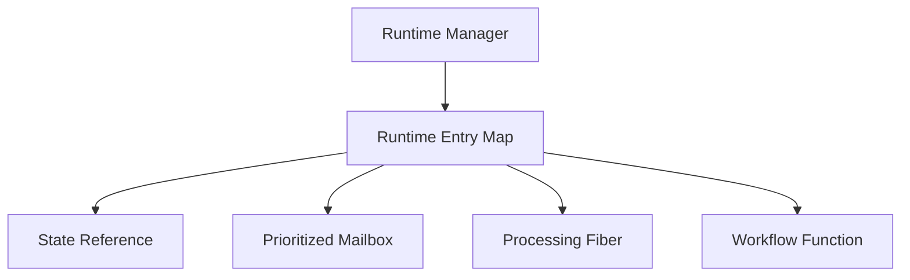
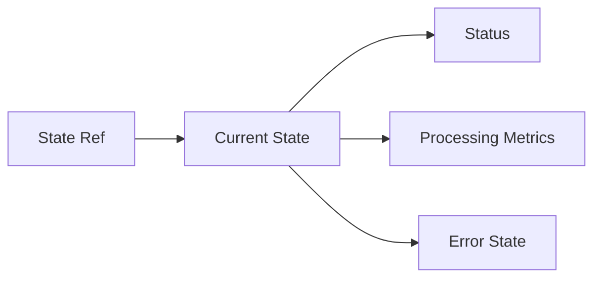
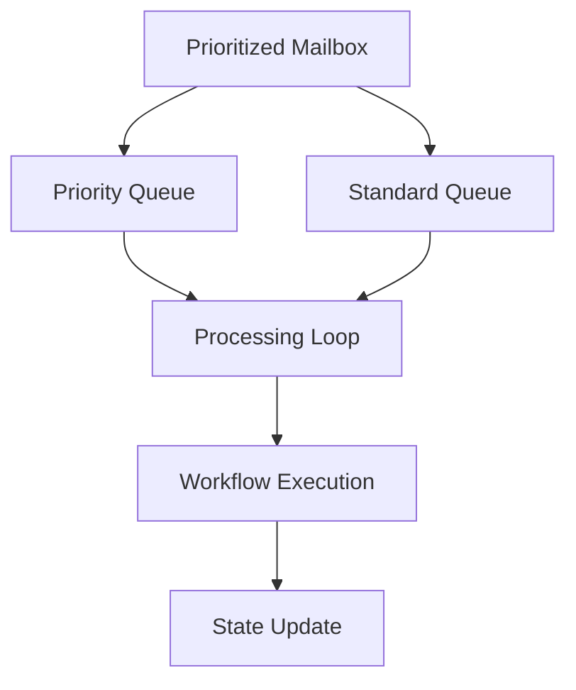
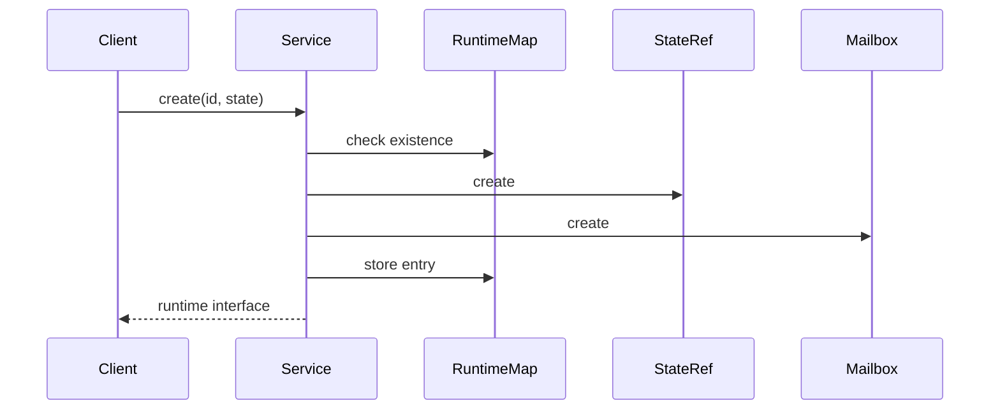
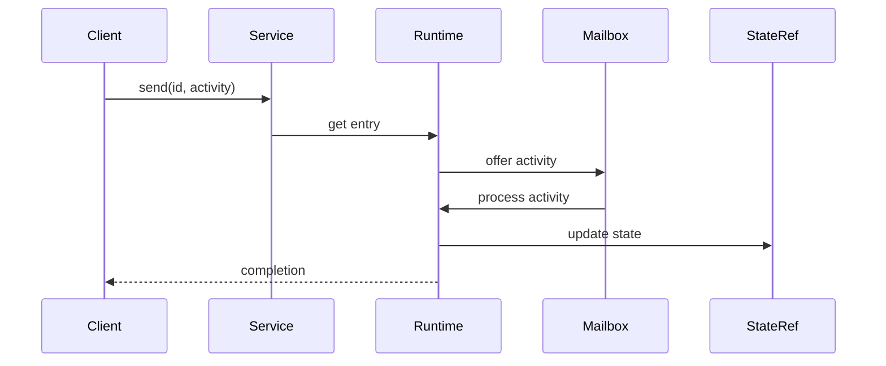

# Agent Runtime Service Architecture

## Overview

The Agent Runtime Service is built on a message-driven architecture using Effect for functional programming patterns and type-safe operations. The service manages multiple agent runtimes, each with its own state, message queue, and processing workflow.

## Core Components

### 1. Runtime Manager

The Runtime Manager maintains a thread-safe map of runtime entries, each containing:
- State reference (Effect.Ref)
- Message queue (PrioritizedMailbox)
- Processing fiber (Effect.Fiber)
- Workflow function

### 2. State Management

State is managed through Effect.Ref for thread-safe updates:
- Immutable state updates
- Atomic operations
- Status tracking
- Performance metrics

### 3. Message Processing

Message processing follows a priority-based workflow:
- Priority queue for urgent activities
- Standard queue for regular activities
- Non-blocking processing loop
- State updates via workflow function

## Processing Pipeline

### Activity Flow
1. Activity Reception
   - Activity validation
   - Priority assignment
   - Queue selection

2. Processing
   - Activity dequeuing
   - Status update
   - Workflow execution
   - State update
   - Metrics collection

3. Error Handling
   - Error capture
   - State update
   - Metrics update
   - Error propagation

## Component Interactions

### Runtime Creation

### Activity Processing

## Implementation Details

### 1. Effect Usage
The service heavily utilizes Effect for:
- Resource management
- Error handling
- Concurrency control
- State management

### 2. Type Safety
Strong typing is enforced through:
- Generic state types
- Tagged error types
- Runtime type checking
- Type-safe interfaces

### 3. Resource Management
Resources are managed through:
- Fiber supervision
- Mailbox cleanup
- State cleanup
- Error recovery

## Performance Considerations

### 1. Memory Management
- Efficient state updates
- Queue size limits
- Resource cleanup

### 2. Concurrency
- Non-blocking operations
- Fiber-based processing
- Thread-safe state updates

### 3. Scalability
- Independent runtime instances
- Prioritized processing
- Resource isolation

## Error Handling Strategy

### 1. Error Types
- Runtime errors
- Processing errors
- Not found errors

### 2. Recovery Mechanisms
- State preservation
- Error tracking
- Metrics updates
- Graceful degradation

## Testing Architecture

### 1. Unit Testing
- Component isolation
- State verification
- Error handling
- Type checking

### 2. Integration Testing
- Runtime lifecycle
- Activity processing
- State management
- Error propagation

## Security Architecture

### 1. State Protection
- Immutable updates
- Access control
- Type safety

### 2. Resource Protection
- Queue limits
- Processing timeouts
- Error boundaries

## Future Considerations

### 1. Scalability
- Distributed runtime support
- Enhanced state persistence
- Improved monitoring

### 2. Features
- Advanced command processing
- Custom activity types
- Enhanced metrics
- State snapshots 