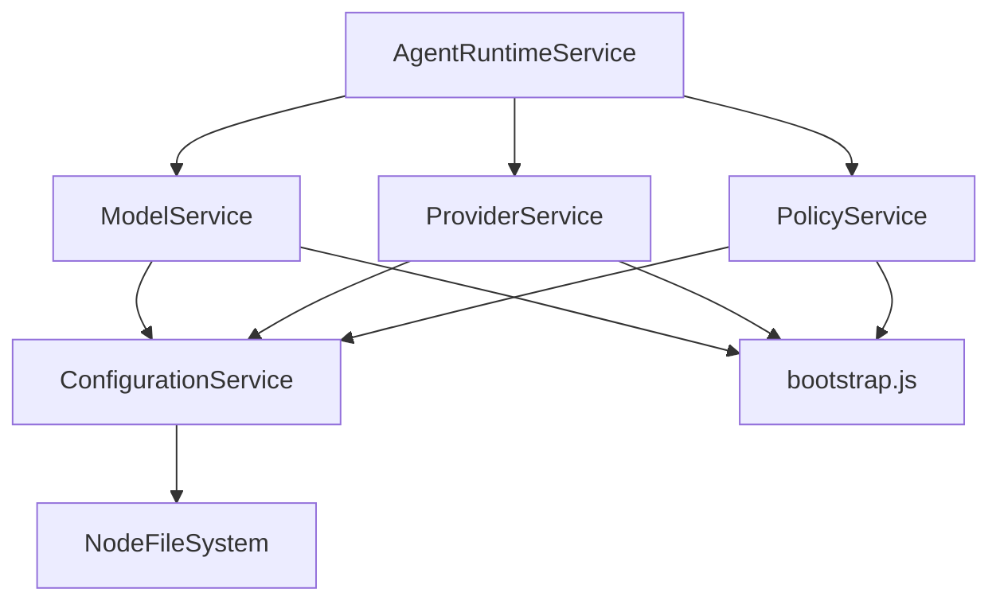

# Agent Runtime Service PRD

## Overview
The Agent Runtime Service is the central orchestration layer in the EffectiveAgent system, providing a TypeScript-based runtime environment for managing agent lifecycles while serving as the primary interface for accessing configured AI services. It combines robust agent management capabilities with seamless access to ModelService, ProviderService, and PolicyService through a unified, functional interface built on Effect-TS.

## Core Features

### 1. Agent Runtime Management
- **Creation**: Dynamic instantiation of agent runtimes with unique IDs and type-safe initial states
- **Termination**: Graceful shutdown with proper fiber cleanup and resource management
- **State Management**: Thread-safe state handling via Effect.Ref with atomic updates
- **Activity Processing**: Prioritized message processing with structured error handling
- **Lifecycle Monitoring**: Real-time status tracking and processing metrics

### 2. Service Access Layer
- **ModelService Access**: Configured AI model validation, capability queries, and metadata
- **ProviderService Access**: AI provider client management and configuration
- **PolicyService Access**: Policy enforcement, rule management, and outcome recording
- **Unified Interface**: Single entry point for all AI services with proper dependency injection

### 3. Communication & Processing
- **Activity Sending**: Asynchronous activity submission with priority handling
- **State Querying**: Real-time state observation with type-safe access
- **Event Subscription**: Stream-based subscription to agent activities
- **Message Processing**: Priority-based message queue with workflow execution

### 4. Configuration Management
- **Service Self-Configuration**: Each service loads its own configuration via ConfigurationService
- **Bootstrap Integration**: Master configuration access through bootstrap() function
- **Schema Validation**: Type-safe configuration loading with Effect Schema validation

## Technical Specifications

### Architecture Pattern
```typescript
// Effect.Service pattern for all services
export class ServiceName extends Effect.Service<ServiceApi>()(
  "ServiceName", 
  { 
    effect: serviceImplementationEffect,
    dependencies: [ConfigurationService.Default]
  }
) { }
```

### Runtime States
```typescript
enum AgentRuntimeStatus {
    IDLE = "IDLE",
    PROCESSING = "PROCESSING",
    ERROR = "ERROR",
    TERMINATED = "TERMINATED"
}
```

### Activity Types
```typescript
enum AgentRecordType {
    COMMAND = "COMMAND",
    STATE_CHANGE = "STATE_CHANGE"
}
```

### Service APIs
The service provides access to:
- **ModelServiceApi**: Model validation, capability queries, provider mapping
- **ProviderServiceApi**: Provider validation, client creation, configuration
- **PolicyServiceApi**: Policy checking, rule management, auditing

## System Architecture

### Service Composition


### Dependency Flow
1. **Bootstrap**: Master config loaded via `MASTER_CONFIG_PATH` environment variable
2. **Service Init**: Each service calls `bootstrap()` to get specific config paths
3. **Config Loading**: Services load and validate their configurations via ConfigurationService
4. **Service Ready**: AgentRuntimeService provides access to fully configured services

### State Management
- **Effect.Ref**: Thread-safe state containers for agent state
- **Immutable Updates**: All state changes through pure functions
- **Atomic Operations**: Consistent state transitions
- **Status Tracking**: IDLE → PROCESSING → IDLE/ERROR → TERMINATED lifecycle

## Core Use Cases

### 1. Agent Creation & Management
```typescript
const runtime = yield* agentRuntimeService.create("my-agent", { 
  userId: "user1",
  model: "gpt-4o",
  state: "idle"
});

yield* agentRuntimeService.send("my-agent", activity);
const state = yield* agentRuntimeService.getState("my-agent");
yield* agentRuntimeService.terminate("my-agent");
```

### 2. AI Service Access
```typescript
const modelService = yield* agentRuntimeService.getModelService();
const providerService = yield* agentRuntimeService.getProviderService();
const policyService = yield* agentRuntimeService.getPolicyService();

// Validate model before use
const isValid = yield* modelService.validateModel("gpt-4o");

// Check policy compliance
const policyResult = yield* policyService.checkPolicy({
  auth: { userId: "user1" },
  requestedModel: "gpt-4o",
  operationType: "text:generate"
});
```

### 3. Integrated Workflow
```typescript
const completeWorkflow = Effect.gen(function* () {
  const agentRuntime = yield* AgentRuntimeService;
  
  // Access services
  const modelService = yield* agentRuntime.getModelService();
  const policyService = yield* agentRuntime.getPolicyService();
  
  // Validate and check policy
  const modelValid = yield* modelService.validateModel("gpt-4o");
  const policyResult = yield* policyService.checkPolicy(context);
  
  if (modelValid && policyResult.allowed) {
    // Create and manage agent
    const runtime = yield* agentRuntime.create(id, initialState);
    yield* agentRuntime.send(id, activity);
    const finalState = yield* agentRuntime.getState(id);
  }
});
```

## Performance Characteristics

### Memory Management
- **Efficient State Updates**: Immutable state with structural sharing
- **Fiber Management**: Lightweight concurrent processing
- **Resource Cleanup**: Automatic cleanup on termination
- **Queue Limits**: Bounded mailbox sizes prevent memory leaks

### Concurrency Model
- **Fiber-based Processing**: Non-blocking concurrent operations
- **Priority Queues**: Activity prioritization for urgent tasks
- **State Isolation**: Independent agent state management
- **Thread Safety**: Effect.Ref provides safe concurrent access

### Processing Metrics
- Processing count and failure tracking
- Average processing time calculation
- Last error capture and context
- Status transition timestamps

## Error Handling Strategy

### Error Hierarchy
```typescript
class AgentRuntimeError extends Data.TaggedError("AgentRuntimeError")
class AgentRuntimeNotFoundError extends AgentRuntimeError
class AgentRuntimeProcessingError extends AgentRuntimeError
class AgentRuntimeTerminatedError extends AgentRuntimeError
```

### Recovery Mechanisms
- **Graceful Degradation**: Continue operation with reduced functionality
- **State Preservation**: Maintain agent state during errors
- **Error Context**: Preserve error causes for debugging
- **Metrics Updates**: Track error rates and patterns

## Testing Strategy

### Test Architecture
- **Real Services**: No mocks, use real service implementations
- **Temporary Configs**: Create test configuration files in beforeEach
- **Layer Composition**: Use Layer.mergeAll for dependency injection
- **Comprehensive Cleanup**: Remove test files and reset environment

### Test Coverage
- Agent lifecycle operations (create, send, getState, terminate)
- Service access methods (getModelService, getProviderService, getPolicyService)
- Error handling scenarios
- Configuration loading and validation
- State management and transitions

## Security Model

### Configuration Security
- **Schema Validation**: Type-safe configuration loading
- **Path Validation**: Secure file path resolution
- **Environment Isolation**: Environment-specific configuration

### Runtime Security
- **State Encapsulation**: Private agent state management
- **Resource Limits**: Bounded queues and processing limits
- **Error Containment**: Isolated error handling per agent
- **Type Safety**: Compile-time verification of operations

## Development Guidelines

### Code Standards
- Effect.Service pattern for all service definitions
- Bootstrap-based configuration loading
- Comprehensive error handling with typed errors
- Strong TypeScript typing throughout

### Service Implementation Rules
1. Use Effect.Service class pattern (not Context.Tag)
2. Load own configuration via ConfigurationService + bootstrap()
3. Declare ConfigurationService.Default in dependencies
4. Implement proper error handling with domain-specific errors
5. Provide type-safe APIs with Effect return types

## Future Enhancements

### Planned Features
- **Distributed Agents**: Cross-node agent communication
- **State Persistence**: Durable agent state storage
- **Advanced Monitoring**: Enhanced metrics and observability
- **Hot Configuration**: Runtime configuration updates without restart

### Scalability Roadmap
- **Horizontal Scaling**: Multi-instance deployment support
- **State Partitioning**: Distributed state management
- **Load Balancing**: Intelligent agent placement strategies
- **Resource Optimization**: Advanced memory and CPU management

## Dependencies

### Core Dependencies
- **Effect**: Functional programming, dependency injection, error handling
- **Stream**: Reactive programming for event subscriptions
- **Schema**: Type-safe configuration validation
- **FileSystem**: Configuration file loading

### Service Dependencies
- **ConfigurationService**: Centralized configuration management
- **ModelService**: AI model configuration and validation
- **ProviderService**: AI provider management
- **PolicyService**: Policy enforcement and auditing

## Maintenance & Support

### Monitoring
- Agent creation/termination rates
- Processing latency and throughput
- Error rates by type and service
- Configuration loading performance

### Troubleshooting
- Comprehensive error logging with context
- State transition tracking
- Service health checks
- Configuration validation diagnostics

## Integration Guidelines

### Application Bootstrap
```typescript
const ApplicationLayer = Layer.mergeAll(
  ConfigurationService.Default,
  ModelService.Default,
  ProviderService.Default,
  PolicyService.Default,
  AgentRuntimeService.Default,
  NodeFileSystem.layer
);

const app = Effect.provide(applicationLogic, ApplicationLayer);
```

### Environment Setup
- Set `MASTER_CONFIG_PATH` environment variable
- Ensure configuration files exist at specified paths
- Configure proper logging levels and file paths
- Set up required API keys for providers 